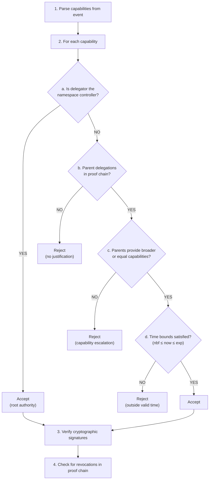
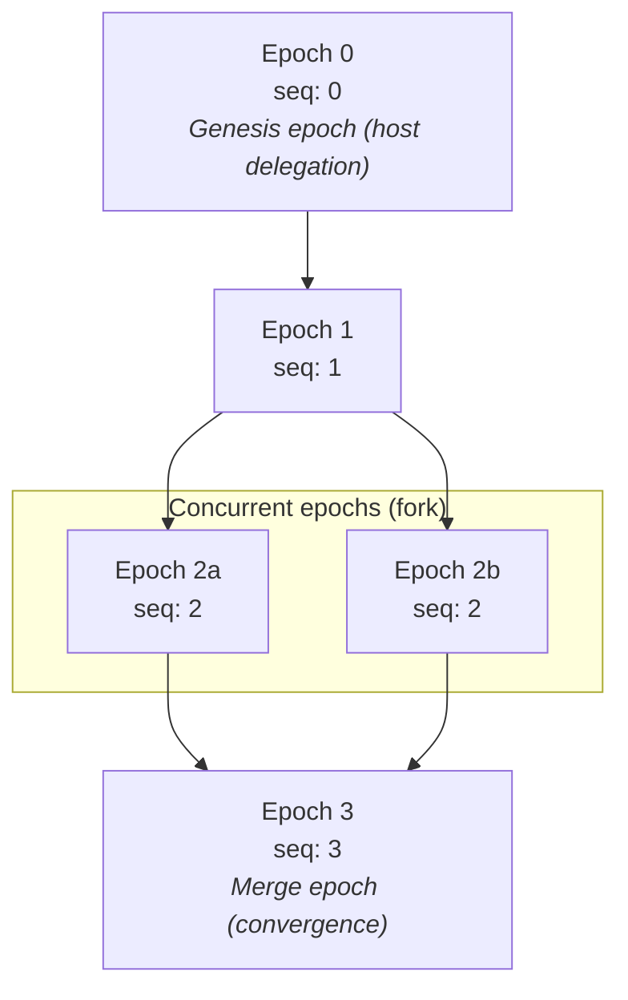
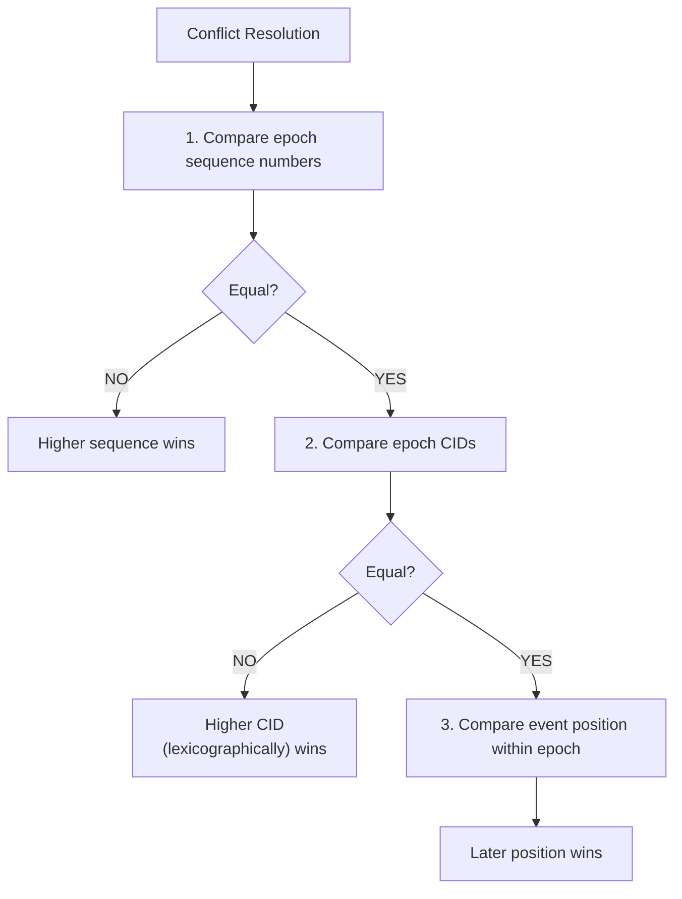
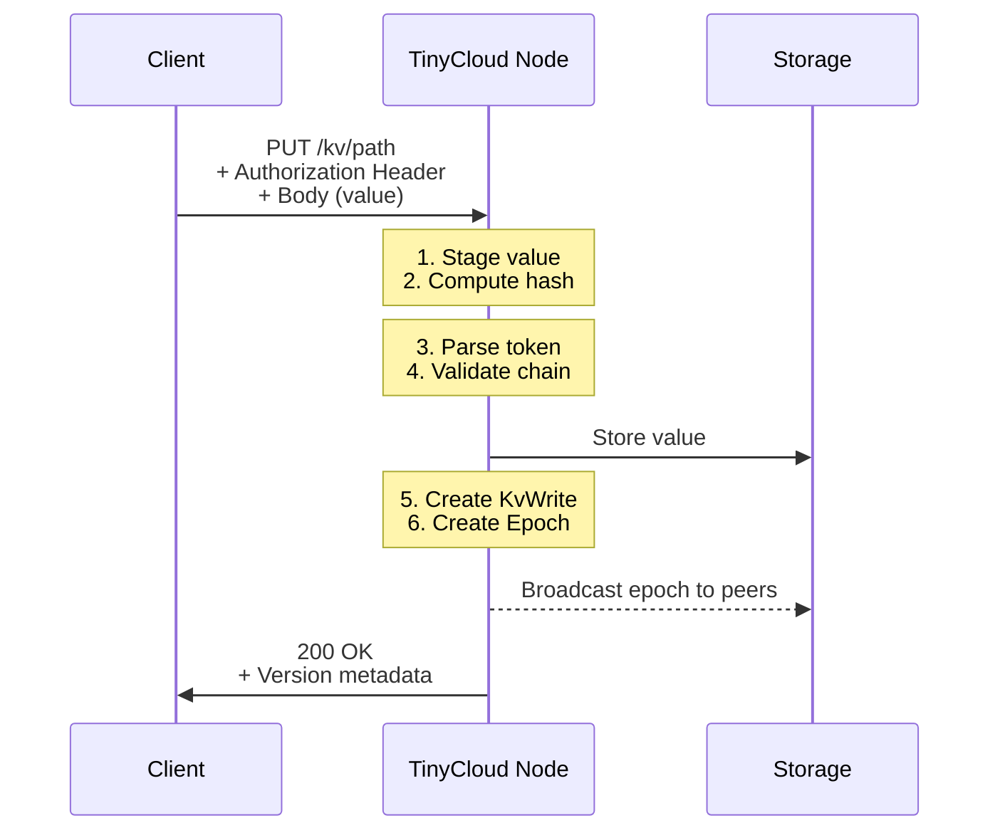
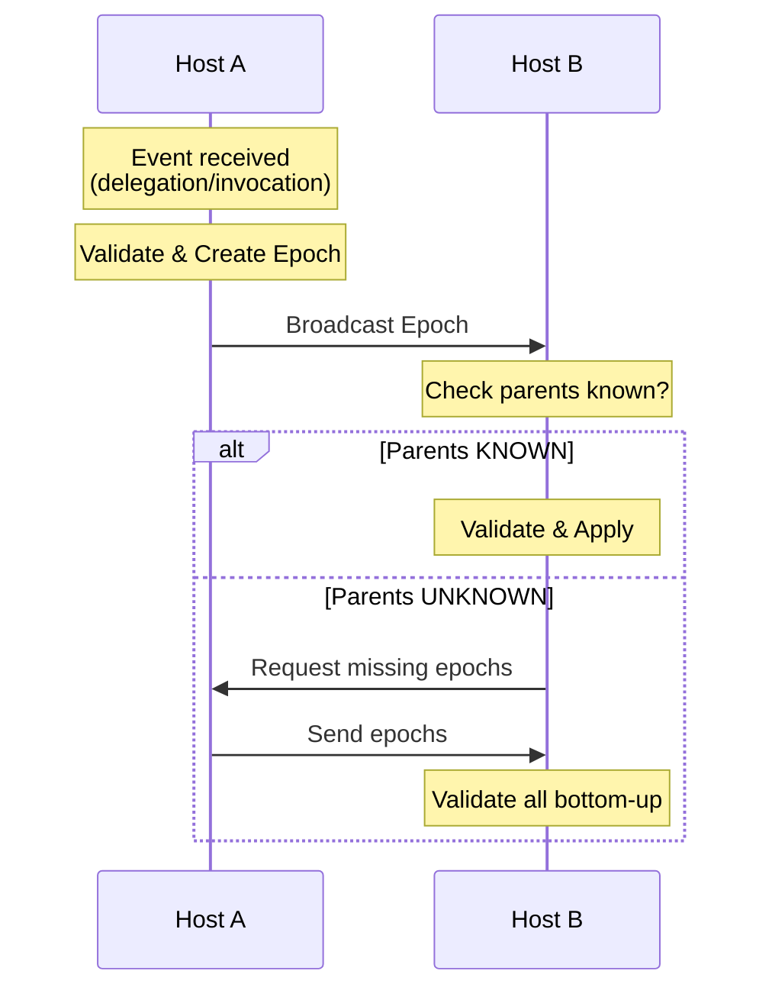
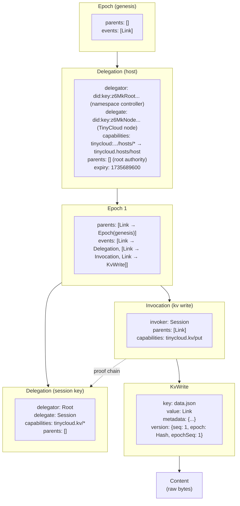

# TinyCloud Protocol: Technical Appendix

This document contains detailed technical specifications and background material for the TinyCloud Protocol. For the conceptual overview, see [whitepaper.md](./whitepaper.md).

---

## Table of Contents

- [Appendix A: Background Technologies](#appendix-a-background-technologies)
- [Appendix B: TinyCloud URI ABNF Grammar](#appendix-b-tinycloud-uri-abnf-grammar)
- [Appendix C: IPLD Schema Definitions](#appendix-c-ipld-schema-definitions)
- [Appendix D: Detailed Diagrams](#appendix-d-detailed-diagrams)
- [Appendix E: SIWE ReCaps Example](#appendix-e-siwe-recaps-example)
- [Appendix F: Glossary of Terms](#appendix-f-glossary-of-terms)
- [References](#references)

---

## Appendix A: Background Technologies

### A.1 Decentralized Identifiers (DIDs)

A Decentralized Identifier (DID) is a globally unique identifier that does not require a centralized registration authority [2]. DIDs are URIs that associate a DID subject with a DID document, enabling verifiable, decentralized digital identity.

**Example DID:**
```
did:key:z6MkiTBz1ymuepAQ4HEHYSF1H8quG5GLVVQR3djdX3mDooWp
```

DIDs provide the cryptographic foundation for TinyCloud, as each namespace is controlled by a DID whose private key holder has root authority over all resources.

**Reference:** W3C DID Core Specification [2]

### A.2 User-Controlled Authorization Networks (UCANs)

UCANs are a trustless, secure, local-first, user-originated authorization and revocation scheme [3]. They extend JSON Web Tokens (JWTs) to provide public-key verifiable, delegable, expressive capabilities.

Key UCAN concepts relevant to TinyCloud:

| Term | Definition |
|------|------------|
| **Capability** | An association of an ability to a resource: `resource × ability × caveats` |
| **Delegation** | The act of granting another principal the capability to use a resource |
| **Attenuation** | The process of constraining capabilities in a delegation chain |
| **Revocation** | Invalidating a UCAN after issuance |

**Example UCAN Capability:**
```json
{
  "tinycloud:pkh:eip155:1:0x6a12...C04B:default/kv/demo-app": {
    "tinycloud.kv/put": [{}],
    "tinycloud.kv/get": [{}]
  }
}
```

TinyCloud uses UCAN v0.10.0, which allows delegations to include multiple capabilities in a single token, minimizing user experience friction.

**Reference:** UCAN Specification v0.10.0 [3]

### A.3 Sign-In with Ethereum (SIWE) and ReCaps

For users with cryptocurrency wallets, TinyCloud supports Sign-In with Ethereum (SIWE) [4] with ReCaps extensions [5]. SIWE allows Ethereum account holders to sign messages for authentication, while ReCaps (EIP-5573) enables encoding UCAN-like capability semantics within SIWE messages.

UCANs and SIWE ReCaps are functionally equivalent—they represent the same authorization data in different serialization formats:

| Format | Use Case | Signature Type |
|--------|----------|----------------|
| UCAN | Native applications, server-to-server | EdDSA, ECDSA |
| SIWE + ReCaps | Ethereum wallet users | Ethereum personal_sign |

**References:** EIP-4361 (SIWE) [4], EIP-5573 (ReCaps) [5]

### A.4 Chain Agnostic CApability Object (CACAO)

CACAO (Chain Agnostic CApability Object), defined in CAIP-74 [11], provides the IPLD-based container format for storing signed capability delegations. A CACAO wraps the result of a SIWE or other chain-specific signing operation into a content-addressable, deterministically serializable object.

**CACAO Structure:**

| Component | Description |
|-----------|-------------|
| **Header (h)** | Identifies the payload format (e.g., `eip4361` or `caip122`) |
| **Payload (p)** | Contains domain, issuer DID, audience, timestamps, nonce, and resources |
| **Signature (s)** | The cryptographic signature and verification method |

CACAOs enable capability chaining—each CACAO can reference parent capabilities, forming a verifiable delegation tree. When serialized using DAG-CBOR, CACAOs are identified by their Content Identifier (CID), enabling content-addressed storage and retrieval.

**Example CACAO Payload:**
```json
{
  "h": { "t": "eip4361" },
  "p": {
    "domain": "demo.tinycloud.xyz",
    "iss": "did:pkh:eip155:1:0x6a12c8594c5C850d57612CA58810ABb8aeBbC04B",
    "aud": "did:key:z6MksDuzXANBQ17iUHQ9M1yhHaUbiadAeHRiQdRMfymNgSmk",
    "version": "1",
    "nonce": "a6uoSZI5TfxzI4IFf",
    "iat": "2025-12-04T13:21:48.263Z",
    "resources": ["urn:recap:eyJhdHQiOnsi..."]
  },
  "s": { "t": "eip191", "s": "0x..." }
}
```

**Reference:** CAIP-74 [11]

### A.5 The `did:pkh` Method

The `did:pkh` (DID Public Key Hash) method [12] enables blockchain addresses to function as Decentralized Identifiers without requiring on-chain registration. This method derives a DID directly from a blockchain account address.

**Format:**
```
did:pkh:<chain-namespace>:<chain-id>:<account-address>
```

**Example:**
```
did:pkh:eip155:1:0x6a12c8594c5C850d57612CA58810ABb8aeBbC04B
       └─────┘ └┘ └──────────────────────────────────────┘
       namespace chain-id        Ethereum address
```

| Component | Description |
|-----------|-------------|
| `eip155` | CAIP-2 namespace for EVM-compatible chains |
| `1` | Chain ID (1 = Ethereum mainnet) |
| `0x6a12...` | The Ethereum account address |

This DID method is particularly important for TinyCloud as it allows Ethereum users to control TinyCloud namespaces using their existing wallet infrastructure without additional key management.

**Reference:** did:pkh Method Specification [12]

### A.6 Content Addressing and IPLD

TinyCloud uses content addressing through Content Identifiers (CIDs) to reference data immutably [6]. The InterPlanetary Linked Data (IPLD) model provides a canonical way to hash and link data structures into a directed acyclic graph (DAG).

CIDs ensure that:
- Data integrity can be verified without trusting the source
- References to data are stable across network partitions
- Deduplication occurs naturally for identical content

---

## Appendix B: TinyCloud URI ABNF Grammar

The following ABNF grammar (RFC 5234) formally defines the syntax of string primitive types used in TinyCloud DAG nodes:

```abnf
;; ============================================================
;; TinyCloud String Primitives - ABNF Grammar (RFC 5234)
;; ============================================================

;; ------------------------------------------------------------
;; DID (Decentralized Identifier)
;; Reference: W3C DID Core Specification
;; ------------------------------------------------------------

DID                = "did:" method-name ":" method-specific-id
method-name        = 1*method-char
method-char        = %x61-7A / DIGIT  ; lowercase letter or digit
method-specific-id = *idchar *(":" *idchar)
idchar             = ALPHA / DIGIT / "." / "-" / "_" / pct-encoded
pct-encoded        = "%" HEXDIG HEXDIG

;; Common DID method patterns used in TinyCloud:
;;   did:key:z6Mk...     (Ed25519 public key)
;;   did:pkh:eip155:1:0x... (Ethereum address)

;; ------------------------------------------------------------
;; ResourceURI (TinyCloud Autonomic Namespace URI)
;; ------------------------------------------------------------

ResourceURI        = "tinycloud:" did-suffix ":" namespace "/" service-path
did-suffix         = method-name ":" method-specific-id
namespace          = 1*namespace-char
namespace-char     = ALPHA / DIGIT / "-" / "_"
service-path       = service ["/" path]
service            = 1*service-char
service-char       = ALPHA / DIGIT / "-" / "_"
path               = path-segment *("/" path-segment)
path-segment       = *pchar
pchar              = unreserved / pct-encoded / ":" / "@"
unreserved         = ALPHA / DIGIT / "-" / "." / "_" / "~"

;; Wildcard support for capability patterns:
path-pattern       = path-segment *("/" path-segment) ["/" "*"]

;; Examples:
;;   tinycloud:pkh:eip155:1:0x6a12...:default/kv/photos/vacation.jpg
;;   tinycloud:key:z6Mk...:work/capabilities/all
;;   tinycloud:key:z6Mk...:default/hosts/*

;; ------------------------------------------------------------
;; Ability (Capability Action Identifier)
;; ------------------------------------------------------------

Ability            = ability-namespace "/" ability-action
ability-namespace  = 1*ability-ns-char *("." 1*ability-ns-char)
ability-ns-char    = ALPHA / DIGIT / "-" / "_"
ability-action     = 1*ability-act-char
ability-act-char   = ALPHA / DIGIT / "-" / "_"

;; Wildcard for capability matching:
ability-pattern    = ability-namespace "/" ("*" / ability-action)

;; Standard TinyCloud abilities:
;;   tinycloud.kv/get       - Read from key-value store
;;   tinycloud.kv/put       - Write to key-value store
;;   tinycloud.kv/del       - Delete from key-value store
;;   tinycloud.kv/list      - List keys
;;   tinycloud.kv/metadata  - Read metadata
;;   tinycloud.hosts/host   - Host capability
;;
;; SQL Database abilities:
;;   tinycloud.sql/read     - Full read access (any SELECT)
;;   tinycloud.sql/write    - Full write access (INSERT, UPDATE, DELETE)
;;   tinycloud.sql/admin    - Schema changes (CREATE, ALTER, DROP)
;;   tinycloud.sql/select   - SELECT with table/column caveats
;;   tinycloud.sql/insert   - INSERT with table caveats
;;   tinycloud.sql/update   - UPDATE with table/column caveats
;;   tinycloud.sql/delete   - DELETE with table caveats
;;   tinycloud.sql/execute  - Execute specific prepared statements

;; ------------------------------------------------------------
;; Path (Key-Value Store Path)
;; ------------------------------------------------------------

Path               = ["/" ] path-segment *("/" path-segment)
path-segment       = 1*path-char
path-char          = ALPHA / DIGIT / "-" / "_" / "." / "~"
                   / pct-encoded

;; Path pattern for capability matching:
path-match-pattern = path-segment *("/" path-segment) ["/" "*"]

;; Examples:
;;   photos/vacation.jpg
;;   data/users/alice/profile.json
;;   config

;; ------------------------------------------------------------
;; Core Rules (from RFC 5234 Appendix B.1)
;; ------------------------------------------------------------

ALPHA              = %x41-5A / %x61-7A   ; A-Z / a-z
DIGIT              = %x30-39             ; 0-9
HEXDIG             = DIGIT / "A" / "B" / "C" / "D" / "E" / "F"
                   / "a" / "b" / "c" / "d" / "e" / "f"
```

---

## Appendix C: IPLD Schema Definitions

TinyCloud's authorization state is encoded as an IPLD (InterPlanetary Linked Data) directed acyclic graph. This section formally defines the data structures using IPLD Schema notation [9].

### C.1 Core Type Definitions

```ipldsch
## TinyCloud Protocol IPLD Schema
## Version: 1.0

## ============================================================
## Primitive Types
## ============================================================

## A Content Identifier (CID) linking to another node in the DAG
type Link &Any

## Decentralized Identifier string (e.g., "did:key:z6Mk...")
type DID string

## TinyCloud Resource URI (e.g., "tinycloud:key:z6Mk.../kv/path")
type ResourceURI string

## Ability string following namespace/action format (e.g., "tinycloud.kv/put")
type Ability string

## Path within the key-value store
type Path string

## Unix timestamp in seconds
type Timestamp int

## Raw bytes (used for serialized tokens and content)
type Bytes bytes

## SHA-256 hash represented as bytes
type Hash bytes
```

### C.2 Capability Structure

```ipldsch
## ============================================================
## Capability Types
## ============================================================

## A capability associates a resource with an ability and optional caveats
type Capability struct {
    resource ResourceURI
    ability Ability
    caveats optional Caveats
} representation map

## Caveats constrain how a capability may be used
## The structure is ability-specific and extensible
type Caveats { String : Any }

## A set of capabilities grouped by resource
## Maps resource URIs to their associated abilities
type Capabilities { ResourceURI : AbilitySet }

## Set of abilities for a resource, each with optional caveats
type AbilitySet { Ability : [Caveats] }
```

### C.3 Event Types

```ipldsch
## ============================================================
## Authorization Events
## ============================================================

## Union of all event types that can appear in the DAG
type Event union {
    | Delegation "delegation"
    | Invocation "invocation"
    | Revocation "revocation"
} representation keyed

## ------------------------------------------------------------
## Delegation: Grants capabilities from one principal to another
## ------------------------------------------------------------

type Delegation struct {
    ## The principal granting the delegation (issuer)
    delegator DID

    ## The principal receiving the delegation (audience)
    delegate DID

    ## Capabilities being delegated
    capabilities Capabilities

    ## Parent delegations proving delegator's authority
    ## Empty if delegator is the namespace controller (root authority)
    parents [Link]

    ## Expiration timestamp (capability invalid after this time)
    expiry optional Timestamp

    ## Not-before timestamp (capability invalid before this time)
    notBefore optional Timestamp

    ## Issuance timestamp
    issuedAt optional Timestamp

    ## Arbitrary facts/metadata
    facts optional { String : Any }

    ## Original serialized token (UCAN JWT or CACAO)
    serialization Bytes
} representation map

## ------------------------------------------------------------
## Invocation: Exercises a capability to perform an action
## ------------------------------------------------------------

type Invocation struct {
    ## The principal performing the invocation
    invoker DID

    ## Capabilities being exercised
    capabilities Capabilities

    ## Delegation chain proving invoker's authority
    parents [Link]

    ## Timestamp when invocation was issued
    issuedAt Timestamp

    ## Arbitrary facts/metadata (e.g., request parameters)
    facts optional { String : Any }

    ## Original serialized token
    serialization Bytes
} representation map

## ------------------------------------------------------------
## Revocation: Invalidates a delegation
## ------------------------------------------------------------

type Revocation struct {
    ## The principal performing the revocation
    revoker DID

    ## Link to the delegation being revoked
    revoked Link

    ## Delegation chain proving revoker's authority to revoke
    ## Revoker must be in the original delegation's proof chain
    parents [Link]

    ## Original serialized revocation message
    serialization Bytes
} representation map
```

### C.4 Epoch Structure

```ipldsch
## ============================================================
## Epoch: Container for ordering events
## ============================================================

## An epoch is a signed container that orders events within the DAG
type Epoch struct {
    ## Links to parent epochs (enables DAG structure)
    ## Empty for the genesis epoch
    parents [Link]

    ## Events contained in this epoch
    ## Each entry is either a single event CID or multiple CIDs
    ## (invocations with side effects produce multiple linked nodes)
    events [EventEntry]
} representation map

## An event entry can be a single CID or multiple related CIDs
type EventEntry union {
    | Link "single"
    | [Link] "multiple"
} representation kinded

## Epoch metadata stored in the database
type EpochRecord struct {
    ## Hash-based identifier (derived from epoch contents)
    id Hash

    ## Monotonically increasing sequence number
    seq Int

    ## TinyCloud namespace this epoch belongs to
    orbit ResourceURI
} representation map
```

### C.5 Key-Value Operations

```ipldsch
## ============================================================
## Key-Value Store Operations
## ============================================================

## Metadata associated with a stored value
type Metadata { String : Any }

## A write operation to the key-value store
type KvWrite struct {
    ## TinyCloud namespace
    orbit ResourceURI

    ## Path/key being written
    key Path

    ## Link to the stored content
    value Link

    ## User-defined metadata
    metadata Metadata

    ## Version information for ordering
    version Version
} representation map

## A delete operation in the key-value store
type KvDelete struct {
    ## TinyCloud namespace
    orbit ResourceURI

    ## Path/key being deleted
    key Path

    ## Optional version specifier (deletes specific version)
    ## If absent, deletes the latest version
    version optional Version
} representation map

## Version information for ordering writes
type Version struct {
    ## Global sequence number
    seq Int

    ## Epoch hash this write belongs to
    epoch Hash

    ## Position within the epoch
    epochSeq Int
} representation map
```

### C.6 SQL Operations

```ipldsch
## ============================================================
## SQL Database Operations
## ============================================================

## A SQL query invocation
type SqlQuery struct {
    ## TinyCloud namespace
    orbit ResourceURI

    ## Database path (e.g., "myapp.db")
    database Path

    ## SQL statement to execute
    statement String

    ## Query parameters (for prepared statements)
    parameters [Any]

    ## Version of the database being queried
    version Version
} representation map

## Result of a SQL query
type SqlResult struct {
    ## TinyCloud namespace
    orbit ResourceURI

    ## Database path
    database Path

    ## Column names in result set
    columns [String]

    ## Row data (array of arrays)
    rows [[Any]]

    ## Number of rows affected (for INSERT/UPDATE/DELETE)
    rowsAffected optional Int
} representation map

## SQL capability caveats for table-level access
type SqlTableCaveat struct {
    ## Tables this capability applies to
    tables [String]

    ## Columns accessible (if omitted, all columns)
    columns optional [String]
} representation map

## SQL capability caveats for query-level access
type SqlQueryCaveat struct {
    ## Allowed prepared statements (exact match)
    statements [String]
} representation map
```

### C.7 Serialization Formats

TinyCloud nodes serialize DAG nodes using DAG-CBOR (Concise Binary Object Representation) [10], which provides:

- **Deterministic encoding**: Same data always produces same bytes (required for content addressing)
- **Compact representation**: Efficient storage and transmission
- **IPLD compatibility**: Native support for CID links

| Node Type | IPLD Multicodec | CID Codec |
|-----------|-----------------|-----------|
| Epoch | dag-cbor | 0x71 |
| Delegation | raw | 0x55 |
| Invocation | raw | 0x55 |
| Revocation | raw | 0x55 |
| KvWrite | dag-cbor | 0x71 |
| SqlQuery | dag-cbor | 0x71 |
| SqlResult | dag-cbor | 0x71 |
| Content | raw | 0x55 |

Raw events (delegations, invocations, revocations) are stored as their original serialized bytes (JWT or CACAO format) to preserve signature validity.

---

## Appendix D: Detailed Diagrams

### D.1 Capability Validation Flowchart



### D.2 Epoch DAG Structure



### D.3 Last-Write-Wins Conflict Resolution



### D.4 KV Store Write Process



### D.5 Peer-to-Peer Replication Protocol



### D.6 Complete DAG Structure Example



---

## Appendix E: SIWE ReCaps Example

The following shows a Sign-In with Ethereum message with ReCaps capability delegation:

```json
{
  "domain": "demo.tinycloud.xyz",
  "address": "0x6a12c8594c5C850d57612CA58810ABb8aeBbC04B",
  "statement": "I further authorize the stated URI to perform the following actions on my behalf: (1) 'tinycloud.kv': 'get', 'put' for 'tinycloud:pkh:eip155:1:0x6a12...C04B:default/kv/demo-app'.",
  "uri": "did:key:z6MksDuzXANBQ17iUHQ9M1yhHaUbiadAeHRiQdRMfymNgSmk",
  "version": "1",
  "chainId": 1,
  "nonce": "a6uoSZI5TfxzI4IFf",
  "issuedAt": "2025-12-04T13:21:48.263Z",
  "resources": [
    "urn:recap:eyJhdHQiOnsi..."
  ]
}
```

The `resources` array contains a base64-encoded ReCaps object specifying the delegated capabilities.

### TinyCloud URI Examples

**Key-Value Store Resource:**
```
tinycloud:pkh:eip155:1:0x6a12c8594c5C850d57612CA58810ABb8aeBbC04B:default/kv/photos/vacation.jpg
```

**SQL Database Resource:**
```
tinycloud:pkh:eip155:1:0x6a12c8594c5C850d57612CA58810ABb8aeBbC04B:default/sql/myapp.db
```

**Capabilities Resource:**
```
tinycloud:pkh:eip155:1:0x6a12c8594c5C850d57612CA58810ABb8aeBbC04B:default/capabilities/all
```

**Host Resource:**
```
tinycloud:key:z6MkiTBz1ymuepAQ4HEHYSF1H8quG5GLVVQR3djdX3mDooWp:default/hosts/*
```

---

## Appendix F: Glossary of Terms

| Term | Definition |
|------|------------|
| **Autonomic Namespace** | A namespace that is self-certifying and self-administrating—it contains within its identifier the cryptographic material needed to verify control authority |
| **Capability** | A token representing the right to perform a specific action on a specific resource; in TinyCloud: `resource × ability × caveats` |
| **CACAO** | Chain Agnostic CApability Object—an IPLD container for signed capability delegations (CAIP-74) |
| **Caveat** | A constraint that limits how a capability may be used (e.g., time bounds, path restrictions) |
| **CID** | Content Identifier—a self-describing hash used to reference content-addressed data |
| **DAG** | Directed Acyclic Graph—the data structure used for epochs and authorization state |
| **Delegation** | An authorization event that grants capabilities from one principal to another |
| **DID** | Decentralized Identifier—a globally unique identifier not requiring centralized registration |
| **Epoch** | A signed container of events that establishes ordering in the TinyCloud DAG |
| **Host** | A TinyCloud node authorized to receive events, create epochs, and replicate with peers |
| **Invocation** | An authorization event that exercises a capability to perform an action |
| **IPLD** | InterPlanetary Linked Data—a data model for content-addressed linked data structures |
| **LWW CRDT** | Last-Write-Wins Conflict-free Replicated Data Type—the consistency model for the KV store |
| **Namespace Controller** | The DID that has root authority over a TinyCloud namespace |
| **POLA** | Principle of Least Authority—granting only the minimum capabilities needed |
| **Revocation** | An authorization event that invalidates a delegation |
| **Session Key** | An ephemeral key pair delegated capabilities for a specific session or device |
| **SIWE** | Sign-In with Ethereum—a standard for authenticating with Ethereum accounts (EIP-4361) |
| **SQL Service** | TinyCloud service providing SQLite database storage with capability-based access control |
| **SQLite** | A lightweight, embedded relational database stored as a single file |
| **Table Caveat** | A capability restriction limiting SQL access to specific tables and columns |
| **Query Caveat** | A capability restriction limiting SQL access to specific prepared statements |
| **ReCaps** | SIWE capability extensions enabling UCAN-like semantics (EIP-5573) |
| **UCAN** | User-Controlled Authorization Network—the capability delegation scheme used by TinyCloud |
| **ZK VM** | Zero-Knowledge Virtual Machine—enables verifiable computation with cryptographic proofs |

---

## References

[1] Spruce Systems, "Kepler: Decentralized Storage," GitHub, 2023. [Online]. Available: https://github.com/spruceid/kepler

[2] W3C, "Decentralized Identifiers (DIDs) v1.0," W3C Recommendation, July 2022. [Online]. Available: https://www.w3.org/TR/did-core/

[3] B. Zelenka, D. Holmgren, I. Gozalishvili, P. Krüger, "User Controlled Authorization Network (UCAN) Specification v0.10.0," 2024. [Online]. Available: https://github.com/ucan-wg/spec

[4] W. Entriken et al., "EIP-4361: Sign-In with Ethereum," Ethereum Improvement Proposals, October 2021. [Online]. Available: https://eips.ethereum.org/EIPS/eip-4361

[5] O. Terbu et al., "EIP-5573: ReCaps - SIWE Capability Delegation," Ethereum Improvement Proposals, 2022. [Online]. Available: https://eips.ethereum.org/EIPS/eip-5573

[6] Protocol Labs, "Content Identifiers (CIDs)," IPFS Documentation. [Online]. Available: https://docs.ipfs.io/concepts/content-addressing/

[7] CockroachDB, "Consistency Model," CockroachDB Blog. [Online]. Available: https://www.cockroachlabs.com/blog/consistency-model/

[8] IETF, "JSON Web Token (JWT)," RFC 7519, May 2015. [Online]. Available: https://datatracker.ietf.org/doc/html/rfc7519

[9] IPLD Team, "IPLD Schemas," IPLD Specifications. [Online]. Available: https://ipld.io/specs/schemas/

[10] IPLD Team, "DAG-CBOR Specification," IPLD Specifications. [Online]. Available: https://ipld.io/specs/codecs/dag-cbor/spec/

[11] S. Ukustov, Haardik, "CAIP-74: CACAO - Chain Agnostic CApability Object," Chain Agnostic Improvement Proposals, 2022. [Online]. Available: https://github.com/ChainAgnostic/CAIPs/blob/master/CAIPs/caip-74.md

[12] W3C Credentials Community Group, "did:pkh Method Specification," 2022. [Online]. Available: https://github.com/w3c-ccg/did-pkh/blob/main/did-pkh-method-draft.md

[13] Web of Trust, "Autonomic Namespace," WOT Terms Glossary. [Online]. Available: https://weboftrust.github.io/WOT-terms/docs/glossary/autonomic-namespace

[14] Protocol Labs, "Multiaddr Specification," Multiformats. [Online]. Available: https://multiformats.io/multiaddr/

[15] ChainAgnostic, "CAIP-2: Blockchain ID Specification," Chain Agnostic Improvement Proposals. [Online]. Available: https://github.com/ChainAgnostic/CAIPs/blob/master/CAIPs/caip-2.md

[16] ChainAgnostic, "CAIP-122: Sign-in with X (SIWx)," Chain Agnostic Improvement Proposals. [Online]. Available: https://github.com/ChainAgnostic/CAIPs/blob/master/CAIPs/caip-122.md

[17] SQLite Consortium, "SQLite WebAssembly," SQLite Documentation. [Online]. Available: https://sqlite.org/wasm

[18] RISC Zero, "RISC Zero: Zero-Knowledge Verifiable General Computing," GitHub, 2025. [Online]. Available: https://github.com/risc0/risc0

[19] Succinct Labs, "SP1: RISC-V zkVM," 2025. [Online]. Available: https://github.com/succinctlabs/sp1

[20] PowerSync, "The Current State of SQLite Persistence on the Web," PowerSync Blog, November 2025. [Online]. Available: https://www.powersync.com/blog/sqlite-persistence-on-the-web

---

*This technical appendix accompanies the TinyCloud Protocol Whitepaper. For the conceptual overview, see [whitepaper.md](./whitepaper.md).*
