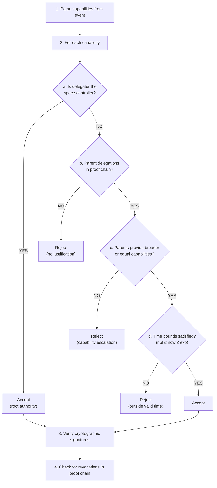
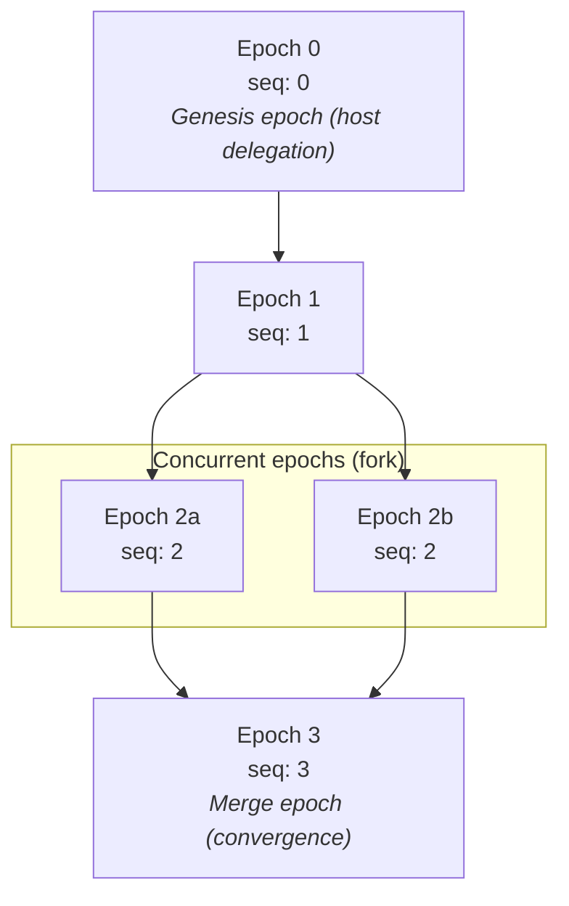
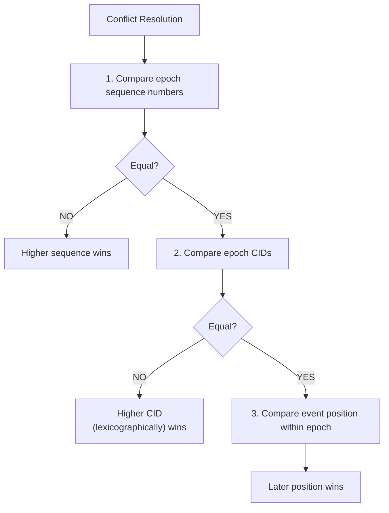
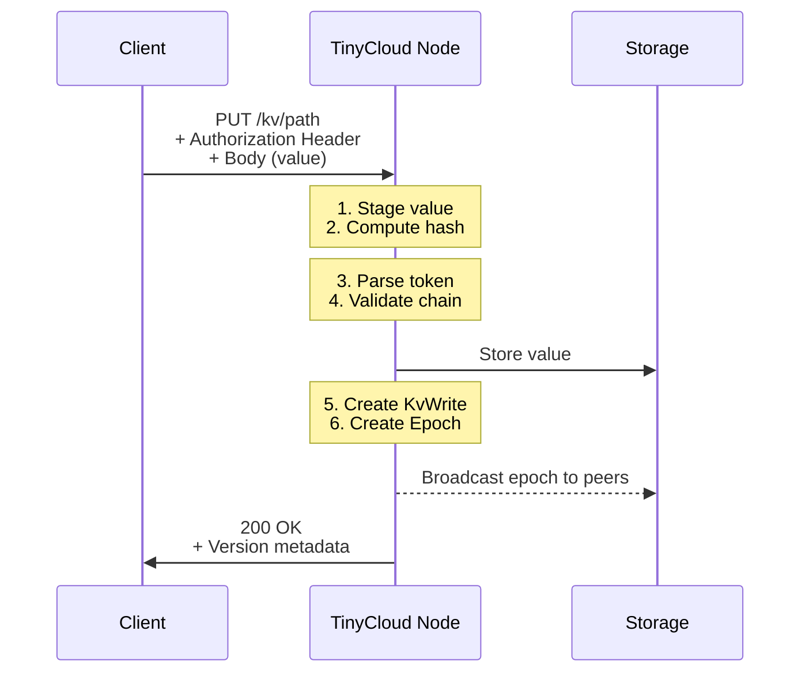
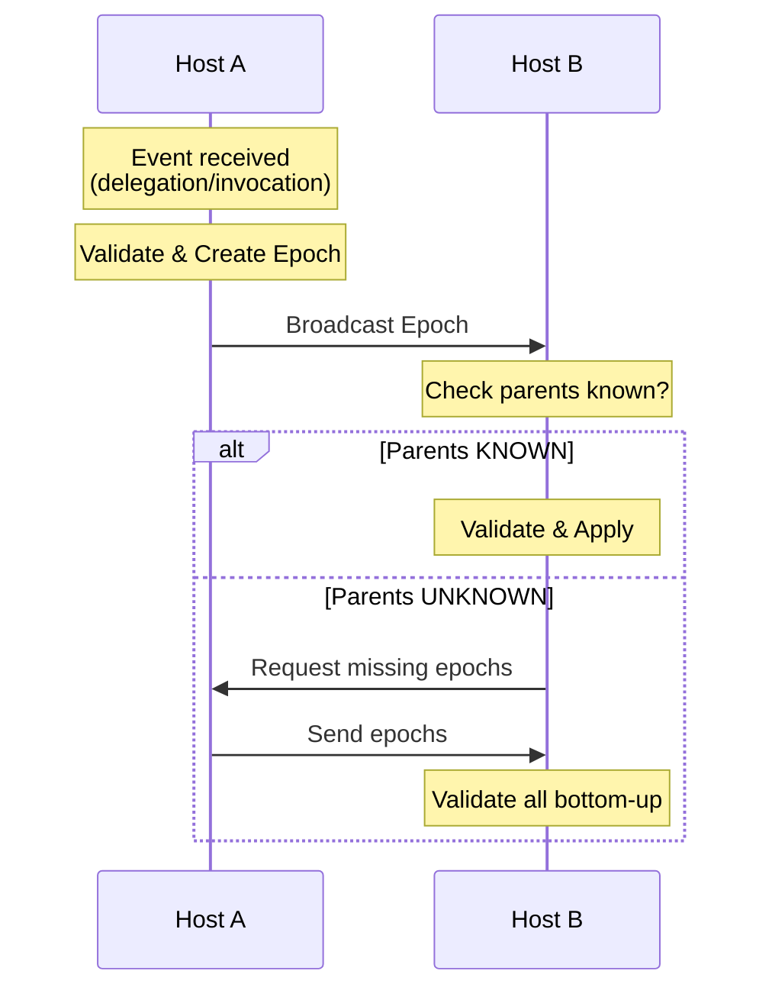
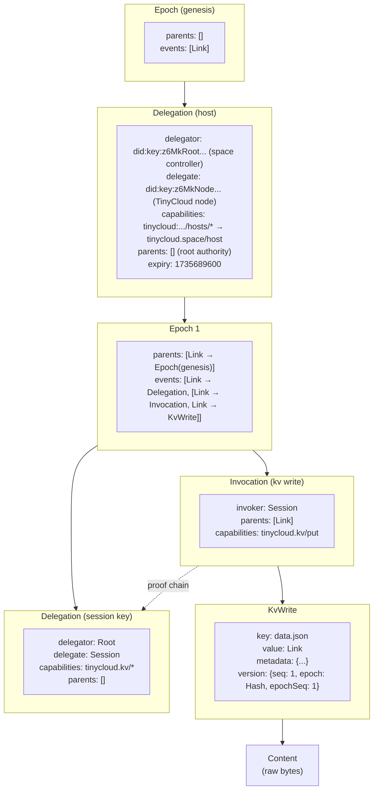

# Appendix D: Detailed Diagrams

## D.1 Capability Validation Flowchart

## D.2 Epoch DAG Structure

## D.3 Last-Write-Wins Conflict Resolution

## D.4 KV Store Write Process

## D.5 Peer-to-Peer Replication Protocol

## D.6 Complete DAG Structure Example

