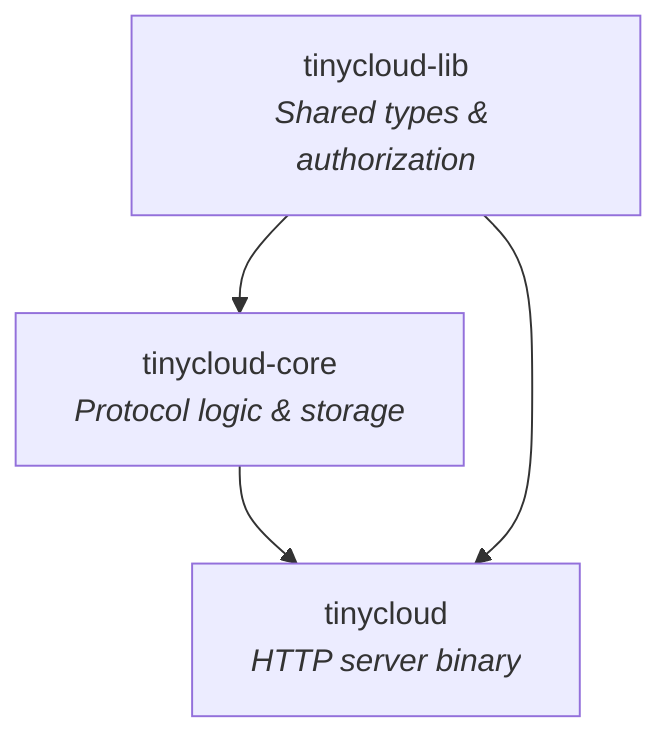
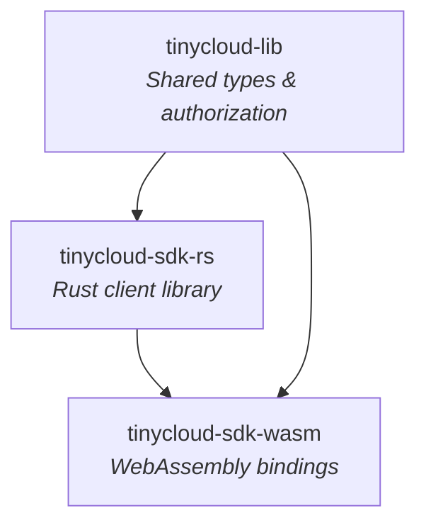
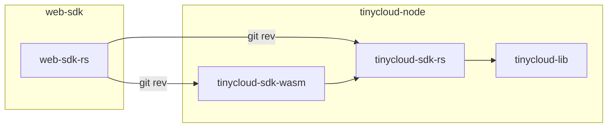
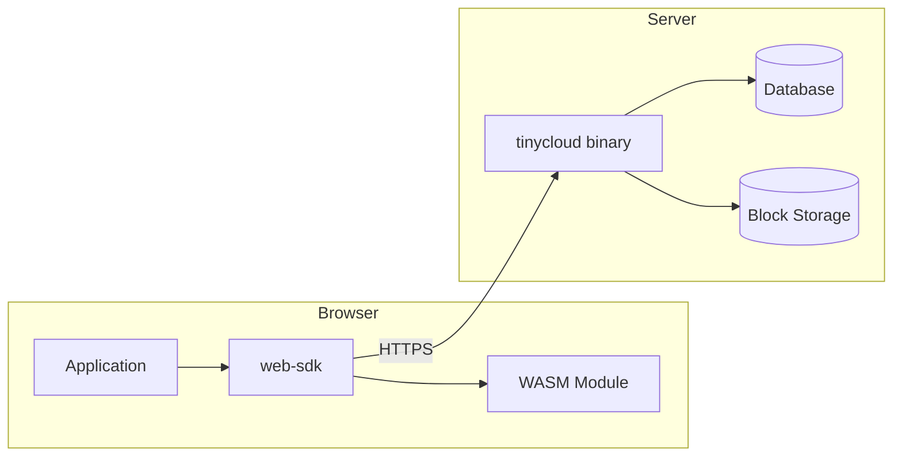

# Appendix G: Package Architecture

This appendix provides an overview of TinyCloud's codebase structure across its two main repositories. Understanding this architecture helps developers navigate the codebase and clarifies what components are deployed where.

## G.1 Repository Overview

TinyCloud is organized into two primary repositories:

| Repository | Purpose |
|------------|---------|
| **tinycloud-node** | Backend server implementation and Rust SDK/WASM bindings |
| **web-sdk** | TypeScript SDK for browser-based applications |

These repositories work together: the web-sdk depends on compiled artifacts from tinycloud-node to provide browser-side cryptographic operations and protocol logic.

## G.2 tinycloud-node Crates

The tinycloud-node repository is a Rust workspace containing several interconnected crates. These crates serve two distinct paths: the server binary and the client SDK.

### Server Path



### SDK Path



### Crate Descriptions

**tinycloud-lib** provides the foundation for the entire system. It defines the core type system including DIDs, resources, paths, and abilities. The authorization framework lives here, implementing UCAN capability semantics and delegation validation. All other crates in the repository depend on tinycloud-lib for these shared primitives.

**tinycloud-core** implements the protocol's business logic. The central type is `SpaceDatabase`, which manages storage transactions, capability verification, and event ordering. This crate defines the database models using SeaORM and handles the serialization of protocol events using IPLD. It abstracts over different storage backends (filesystem, S3) and database engines (SQLite, MySQL, PostgreSQL).

**tinycloud** is the deployable server binary. Built on the Rocket web framework, it exposes HTTP endpoints for invocations, delegations, and peer key generation. This crate configures observability (OpenTelemetry tracing, Prometheus metrics) and handles CORS for browser clients. It wires together tinycloud-core with concrete storage implementations.

**tinycloud-sdk-rs** provides a Rust client library for applications that need to interact with TinyCloud servers. It handles SIWE message construction, request signing, and HTTP communication with nodes.

**tinycloud-sdk-wasm** wraps the Rust SDK for browser environments. It exports functions to JavaScript via wasm-bindgen, enabling session management and cryptographic operations in web applications.

## G.3 web-sdk Packages

The web-sdk repository is a TypeScript monorepo managed with Bun workspaces. It provides the developer-facing API for integrating TinyCloud into web applications.

```mermaid
graph TB
    EXAMPLE[web-sdk-example<br/><i>Reference React application</i>]
    SDK[@tinycloudlabs/web-sdk<br/><i>Public API layer</i>]
    CORE[@tinycloudlabs/web-core<br/><i>Shared types & utilities</i>]
    WASM[@tinycloudlabs/web-sdk-wasm<br/><i>Rust/WASM module</i>]

    EXAMPLE --> SDK
    SDK --> CORE
    SDK --> WASM
    CORE --> WASM
```

### Package Descriptions

**@tinycloudlabs/web-core** contains shared TypeScript types and utilities used across the SDK. It defines interfaces for client configuration, session types, and provider management. ENS resolution utilities and common type definitions live here.

**@tinycloudlabs/web-sdk** is the main package developers import into their applications. The `TinyCloudWeb` class provides the entry point for connecting wallets, managing sessions, and performing storage operations. The `TinyCloudStorage` class handles key-value operations against TinyCloud spaces. This package bundles with Webpack for browser consumption.

**@tinycloudlabs/web-sdk-wasm** bridges Rust and TypeScript. This package is built from Rust source using wasm-pack, then bundled with Rollup. It exposes session management functions, SIWE message construction, and cryptographic signing to the TypeScript layer. Ed25519 key generation and invocation signing happen in this WASM module.

## G.4 Cross-Repository Dependencies

The web-sdk repository depends on tinycloud-node through Git dependencies. The web-sdk-rs package (source for the WASM module) specifies exact commits from tinycloud-node:



When protocol changes occur in tinycloud-node, the web-sdk must be updated to reference the new commit. This is done by updating the `rev` field in the web-sdk-rs `Cargo.toml`, then rebuilding the WASM module.

## G.5 Deployment Architecture

TinyCloud components deploy to two distinct environments: backend servers and browser clients.



### Backend Deployment

The tinycloud server binary is packaged as a Docker container. It runs as a single process handling HTTP requests on port 8000, with Prometheus metrics exposed on port 8001. Storage configuration determines where data lives:

- **Database**: SQLite for development, PostgreSQL or MySQL for production
- **Block Storage**: Local filesystem or AWS S3

The server handles all protocol operations: validating capability chains, executing invocations, storing blocks, and managing delegation state.

### Frontend Deployment

Browser applications include the web-sdk as an npm dependency. The SDK bundles approximately 2MB of JavaScript and WebAssembly. On initialization, the SDK loads the WASM module which provides cryptographic operations.

All data operations require network calls to a TinyCloud node. The SDK handles session persistence in localStorage, capability delegation via wallet signing, and retry logic for transient failures.

### Data Flow

1. User connects wallet via the SDK
2. SDK constructs SIWE message with ReCap capabilities
3. Wallet signs the message, creating a session delegation
4. SDK sends signed invocations to the TinyCloud node
5. Node validates capability chain and executes the operation
6. Response returns to SDK, which deserializes and returns to application
