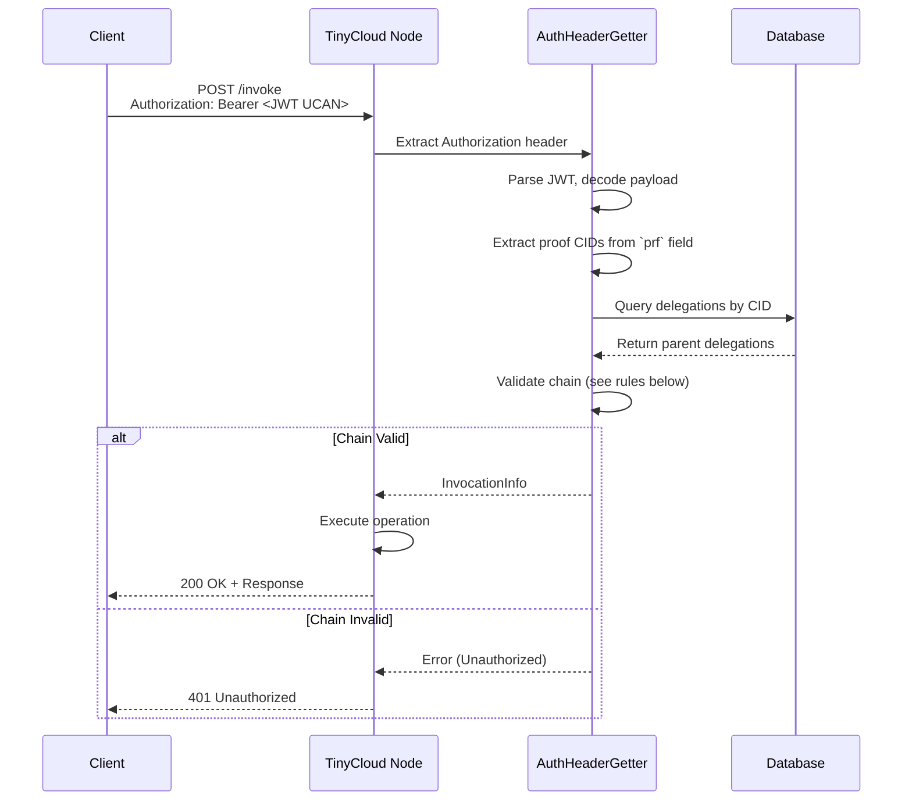
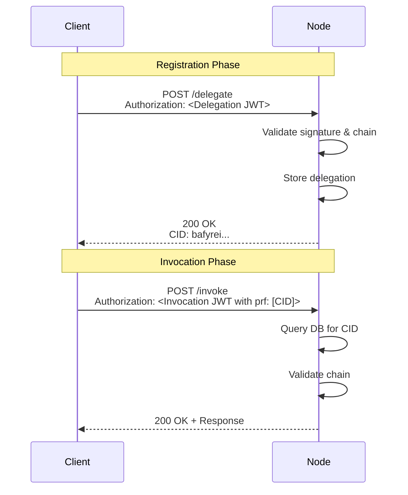
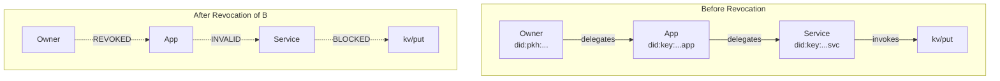
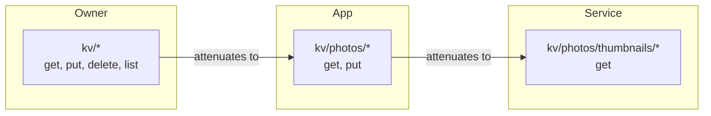

# Appendix H: Delegation Protocol Specification

## Overview

Delegation is TinyCloud's core authorization primitive. It enables capability-based access control through cryptographically signed events that grant, attenuate, and revoke permissions. Every action in TinyCloud requires a valid delegation chain connecting the invoker to the space controller who holds root authority over the resources.

This appendix specifies the delegation protocol as implemented in `tinycloud-node`, covering delegation formats, chain validation, database schema, and revocation semantics.

## H.1 Delegation Types

TinyCloud supports two interoperable delegation formats: UCAN (User Controlled Authorization Networks) and CACAO (Chain Agnostic CApability Object). Both formats encode the same authorization semantics but use different serialization and signature schemes.

### UCAN Format

UCANs are JWT-encoded capability tokens suitable for native applications and server-to-server communication.

**Structure:**

| Field | Type | Description |
|-------|------|-------------|
| `iss` | DID URL | Issuer (delegator) with optional verification method fragment |
| `aud` | DID | Audience (delegatee) receiving the delegation |
| `att` | Capabilities | Map of resources to abilities with optional caveats |
| `prf` | [CID] | Array of parent delegation CIDs proving delegator's authority |
| `exp` | NumericDate | Expiration timestamp (capability invalid after) |
| `nbf` | NumericDate | Not-before timestamp (capability invalid before) |
| `nnc` | String | Nonce for replay protection |
| `fct` | Object | Arbitrary facts/metadata |

**Signature:** EdDSA (Ed25519) or ECDSA (secp256k1), depending on the DID method.

**Example UCAN Payload:**

```json
{
  "iss": "did:key:z6MkiTBz1ymuepAQ4HEHYSF1H8quG5GLVVQR3djdX3mDooWp#z6MkiTBz1ymuepAQ4HEHYSF1H8quG5GLVVQR3djdX3mDooWp",
  "aud": "did:key:z6MksDuzXANBQ17iUHQ9M1yhHaUbiadAeHRiQdRMfymNgSmk",
  "att": {
    "tinycloud:key:z6MkiTBz1ymuepAQ4HEHYSF1H8quG5GLVVQR3djdX3mDooWp:default/kv/photos/*": {
      "tinycloud.kv/get": [{}],
      "tinycloud.kv/put": [{}]
    }
  },
  "prf": [],
  "exp": 1735776000,
  "nbf": 1735689600,
  "nnc": "urn:uuid:550e8400-e29b-41d4-a716-446655440000"
}
```

### CACAO Format

CACAOs are IPLD/DAG-CBOR encoded capability objects designed for Ethereum wallet integration via Sign-In with Ethereum (SIWE).

**Structure:**

| Component | Description |
|-----------|-------------|
| **Header (h)** | Payload format identifier (`eip4361` for SIWE) |
| **Payload (p)** | SIWE message fields with ReCap capabilities in `resources` |
| **Signature (s)** | Ethereum signature and verification method |

**ReCap Extension:** Capabilities are encoded as base64url in the `resources` array following EIP-5573.

**Example CACAO:**

```json
{
  "h": { "t": "eip4361" },
  "p": {
    "domain": "app.tinycloud.xyz",
    "iss": "did:pkh:eip155:1:0x6a12c8594c5C850d57612CA58810ABb8aeBbC04B",
    "aud": "did:key:z6MksDuzXANBQ17iUHQ9M1yhHaUbiadAeHRiQdRMfymNgSmk",
    "version": "1",
    "nonce": "a6uoSZI5TfxzI4IFf",
    "iat": "2025-12-04T13:21:48.263Z",
    "exp": "2025-12-05T13:21:48.263Z",
    "statement": "I further authorize...",
    "resources": ["urn:recap:eyJhdHQiOnsidGlueWNsb3VkOi4uLiI6..."]
  },
  "s": { "t": "eip191", "s": "0x..." }
}
```

## H.2 Delegation Chain Validation

When a client invokes a capability, the node must validate the complete delegation chain from the invoker back to the space controller.

### Request Flow



### Validation Rules

The delegation validation logic in `tinycloud-core/src/models/delegation.rs` enforces the following rules:

#### Rule 1: Signature Verification

Each delegation in the chain must have a valid cryptographic signature:

- **UCAN:** Verify EdDSA/ECDSA signature against issuer's public key from DID resolution
- **CACAO:** Verify EIP-191 signature against the Ethereum address in the issuer DID

```rust
// Simplified from delegation.rs
async fn verify(delegation: &TinyCloudDelegation) -> Result<(), Error> {
    match delegation {
        TinyCloudDelegation::Ucan(ucan) => {
            ucan.verify_signature(&AnyDidMethod::default()).await?;
            ucan.payload().validate_time(None)?;
        }
        TinyCloudDelegation::Cacao(cacao) => {
            cacao.verify().await?;
            if !cacao.payload().valid_now() {
                return Err(DelegationError::InvalidTime)?;
            }
        }
    }
    Ok(())
}
```

#### Rule 2: Delegatee Continuity

For each link in the chain, the parent delegation's delegatee must match the current delegation's delegator:

```
parent.delegatee == current.delegator
```

This ensures capabilities flow only through authorized intermediaries.

#### Rule 3: Time Bounds

All delegations in the chain must be valid at invocation time:

```
now >= delegation.not_before AND now < delegation.expiry
```

Additionally, child delegations cannot extend beyond parent time bounds:

```
parent.expiry > child.expiry
parent.not_before <= child.not_before (if both present)
```

#### Rule 4: Capability Coverage

Each capability in a child delegation must be covered by at least one parent capability:

- **Resource scope:** Child resource must be a subset of parent resource
- **Ability match:** Child ability must match parent ability

```rust
// From delegation.rs validation logic
parent_abilities.iter().any(|pc|
    child.resource.extends(&pc.resource) &&
    child.ability == pc.ability
)
```

#### Rule 5: Resource Extension

Resources follow a path hierarchy. A child resource is valid if it extends (is a subset of) the parent resource:

| Parent Resource | Valid Child | Invalid Child |
|-----------------|-------------|---------------|
| `/kv/*` | `/kv/photos/*` | `/sql/*` |
| `/kv/photos/*` | `/kv/photos/vacation/*` | `/kv/documents/*` |
| `/kv/photos/vacation/*` | `/kv/photos/vacation/img.jpg` | `/kv/photos/work/*` |

The `extends()` method on `Resource` implements this path-prefix checking.

#### Rule 6: Root Authority

A delegation with no parent proofs (`prf: []`) is valid only if the delegator is the space controller:

```rust
// Delegations where delegator == namespace.did() need no parents
let dependant_caps: Vec<_> = delegation.capabilities.iter()
    .filter(|c| {
        c.resource.namespace()
            .map(|ns| **ns.did() != *delegation.delegator)
            .unwrap_or(true)
    })
    .collect();

// If no dependant caps, delegation is valid (root authority)
if dependant_caps.is_empty() {
    return Ok(());
}
```

## H.3 Database Schema

Delegations and their relationships are persisted using the following schema:

```sql
-- delegation: Stores individual delegations
CREATE TABLE delegation (
    id          BLOB PRIMARY KEY,  -- CID hash (content-addressed)
    delegator   TEXT NOT NULL,     -- Issuer DID
    delegatee   TEXT NOT NULL,     -- Audience DID
    expiry      TIMESTAMP,         -- Expiration time
    not_before  TIMESTAMP,         -- Validity start time
    issued_at   TIMESTAMP,         -- Issuance time
    facts       JSON,              -- Arbitrary metadata
    serialization BLOB NOT NULL    -- Original JWT or DAG-CBOR bytes
);

-- parent_delegation: Links delegations in chains
CREATE TABLE parent_delegation (
    parent  BLOB NOT NULL,  -- CID of parent delegation
    child   BLOB NOT NULL,  -- CID of child delegation
    PRIMARY KEY (parent, child),
    FOREIGN KEY (parent) REFERENCES delegation(id),
    FOREIGN KEY (child) REFERENCES delegation(id)
);

-- ability: Stores capabilities granted by delegations
CREATE TABLE ability (
    resource    TEXT NOT NULL,     -- Resource URI
    ability     TEXT NOT NULL,     -- Ability string (e.g., "tinycloud.kv/put")
    delegation  BLOB NOT NULL,     -- Owning delegation CID
    caveats     JSON DEFAULT '{}', -- Capability constraints
    PRIMARY KEY (resource, ability, delegation),
    FOREIGN KEY (delegation) REFERENCES delegation(id)
);

-- actor: Tracks known DIDs
CREATE TABLE actor (
    id TEXT PRIMARY KEY  -- DID string
);

-- revocation: Records revoked delegations
CREATE TABLE revocation (
    id           BLOB PRIMARY KEY,  -- CID hash
    revoker      TEXT NOT NULL,     -- DID of revoker
    revoked      BLOB NOT NULL,     -- CID of revoked delegation
    serialization BLOB NOT NULL,    -- Original revocation message
    FOREIGN KEY (revoker) REFERENCES actor(id),
    FOREIGN KEY (revoked) REFERENCES delegation(id)
);
```

## H.4 Proof Modes

TinyCloud supports two methods for providing delegation proofs during invocation.

### CID Reference (Pre-registered)

The standard mode requires delegations to be registered with the node before use:

1. **Registration:** Client sends `POST /delegate` with the delegation in the Authorization header
2. **Storage:** Node validates, stores delegation, returns CID
3. **Invocation:** Client includes CID(s) in the invocation's `proof` field
4. **Validation:** Node queries database, reconstructs and validates chain



### Inline Proof (Future Enhancement)

A planned enhancement would allow full delegation chains to be included directly in invocations:

- Complete chain embedded in the invocation token
- Node validates chain without prior registration
- Reduces round-trips for ephemeral or one-time grants
- Node may optionally persist delegations for future use

## H.5 Revocation

Revocation allows a delegator to invalidate a previously issued delegation, preventing further use of the granted capabilities.

### Revocation Event Format

```rust
struct RevocationInfo {
    revoker: String,      // DID of the revoker
    revoked: Cid,         // CID of the delegation being revoked
    parents: Vec<Cid>,    // Proof chain (for delegated revocation)
    revocation: TinyCloudRevocation,  // Signed revocation message
}
```

The revocation is encoded as a CACAO with the target delegation CID as the audience:

```json
{
  "h": { "t": "eip4361" },
  "p": {
    "iss": "did:pkh:eip155:1:0x6a12...",
    "aud": "ucan:bafyreic5q4xvd3qwzl2w5jxuysao7i5pxpbkq3mfxj7jdqkqyqwxkz",
    "statement": "Revoke delegation",
    ...
  },
  "s": { "t": "eip191", "s": "0x..." }
}
```

### Authorization Rules

A principal can revoke a delegation if:

1. **Direct revocation:** The revoker is the original delegator
2. **Transitive revocation:** The revoker holds a valid delegation chain to the target (future enhancement)

```rust
// From revocation.rs - verify revoker is the delegator
if delegation.delegator != revocation_info.revoker {
    return Err(RevocationError::UnauthorizedRevoker(r.revoker));
}
```

### Propagation Effects

When a delegation is revoked:

1. The revoked delegation becomes invalid for future invocations
2. All child delegations derived from the revoked delegation become transitively invalid
3. Existing sessions using the revoked delegation lose authorization
4. The revocation event is recorded in the authorization DAG



## H.6 Examples

### Example 1: Simple Delegation (Owner to Session Key)

A space owner creates a session for a browser application:

**Owner DID:** `did:pkh:eip155:1:0x6a12c8594c5C850d57612CA58810ABb8aeBbC04B`
**Session Key DID:** `did:key:z6MksDuzXANBQ17iUHQ9M1yhHaUbiadAeHRiQdRMfymNgSmk`

```json
{
  "iss": "did:pkh:eip155:1:0x6a12c8594c5C850d57612CA58810ABb8aeBbC04B",
  "aud": "did:key:z6MksDuzXANBQ17iUHQ9M1yhHaUbiadAeHRiQdRMfymNgSmk",
  "att": {
    "tinycloud:pkh:eip155:1:0x6a12...C04B:default/kv/*": {
      "tinycloud.kv/get": [{}],
      "tinycloud.kv/put": [{}],
      "tinycloud.kv/delete": [{}],
      "tinycloud.kv/list": [{}]
    }
  },
  "prf": [],
  "exp": 1735862400,
  "nbf": 1735776000
}
```

**Chain:** Owner (root authority) -> Session Key
**Proof required:** None (owner is space controller)

### Example 2: Chained Delegation (Owner to App to Service)

An owner grants an application access, which then delegates a subset to an AI service:

**Level 1: Owner to App**

```json
{
  "iss": "did:pkh:eip155:1:0x6a12...C04B",
  "aud": "did:key:z6MkApp...",
  "att": {
    "tinycloud:pkh:eip155:1:0x6a12...C04B:default/kv/photos/*": {
      "tinycloud.kv/get": [{}],
      "tinycloud.kv/put": [{}]
    }
  },
  "prf": [],
  "exp": 1767225600
}
```

**Level 2: App to AI Service**

```json
{
  "iss": "did:key:z6MkApp...",
  "aud": "did:key:z6MkAISvc...",
  "att": {
    "tinycloud:pkh:eip155:1:0x6a12...C04B:default/kv/photos/*": {
      "tinycloud.kv/get": [{}]
    }
  },
  "prf": ["bafyreic5q4xvd3..."],
  "exp": 1735862400
}
```

**Chain:** Owner -> App -> AI Service
**Validation:**
- App's delegatee matches AI Service's issuer
- AI Service's capabilities (get only) subset of App's (get + put)
- AI Service's expiry before App's expiry

### Example 3: Re-delegation with Attenuation

Capabilities narrow through the delegation chain:



| Principal | Resource Scope | Abilities |
|-----------|---------------|-----------|
| Owner | `kv/*` | get, put, delete, list |
| App | `kv/photos/*` | get, put |
| Service | `kv/photos/thumbnails/*` | get |

Each delegation narrows both the resource scope and available abilities. The service can only read thumbnails, even though the owner has full access to the entire key-value store.

## References

- Appendix A: Background Technologies (UCAN, CACAO, SIWE overview)
- Appendix C: IPLD Schema Definitions (Delegation, Invocation, Revocation types)
- Appendix E: SIWE ReCaps Example (CACAO capability encoding)
- UCAN Specification v0.10.0: https://github.com/ucan-wg/spec
- CAIP-74 (CACAO): https://github.com/ChainAgnostic/CAIPs/blob/master/CAIPs/caip-74.md
- EIP-5573 (ReCaps): https://eips.ethereum.org/EIPS/eip-5573
