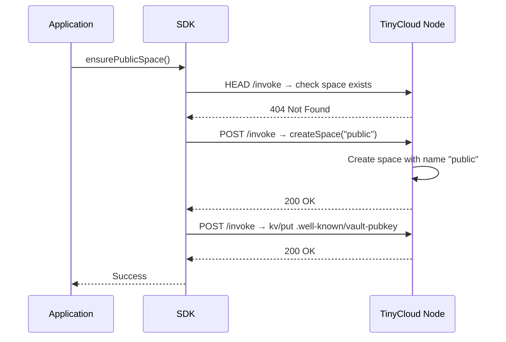
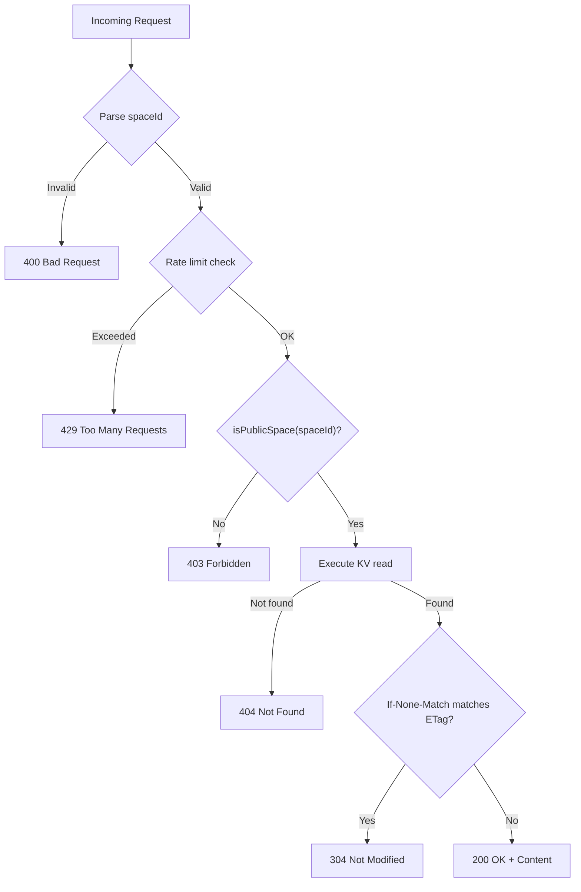
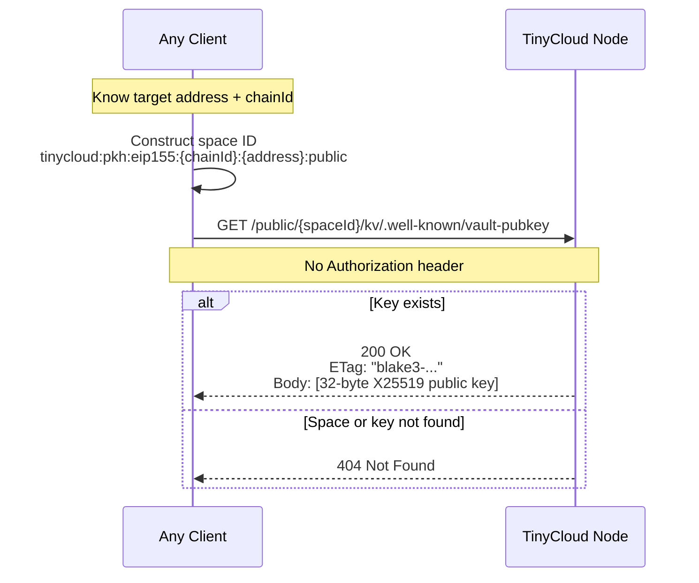

# Appendix K: Public Spaces

## Overview

TinyCloud spaces are access-controlled by default — reading requires a valid delegation chain from the space controller. This design provides strong privacy guarantees but prevents publishing data that others need to discover without prior interaction, such as encryption public keys, user profiles, service endpoints, or public attestations.

Public spaces solve this by providing a well-known, per-user space with unauthenticated read access and owner-controlled writes. Given only an Ethereum address and chain ID, any client can deterministically construct the public space ID and read its contents over plain HTTP — no session, no delegation, no prior relationship required.

## K.1 Space Model

### Deterministic Space ID Construction

A public space uses the same URI format as any TinyCloud space, with the reserved name `public`:

```
tinycloud:pkh:eip155:{chainId}:{address}:public
└────────┘└─────────────────────────────┘└────┘
  scheme          DID suffix            space name
```

**Example:**

```
Address:  0xd8dA6BF26964aF9D7eEd9e03E53415D37aA96045
Chain ID: 1
Space ID: tinycloud:pkh:eip155:1:0xd8dA6BF26964aF9D7eEd9e03E53415D37aA96045:public
```

The space name `public` is a reserved identifier. The server recognizes a space as public based solely on this name segment — no database flag, no special column. The name is the policy.

### One Public Space Per User

Each user identity (address + chain ID) has exactly one public space. This constraint enables fully deterministic discovery: given an address, there is no ambiguity about which space contains the user's public data.

### Name-Based Policy

The server determines whether a space is public by inspecting its name:

```pseudocode
function isPublicSpace(spaceId: SpaceId) -> Boolean:
  return spaceId.name() == "public"
```

When a space is identified as public, the server applies a modified access policy:

| Operation | Policy |
|-----------|--------|
| Read (get, head, list) | Unauthenticated — bypass authorization |
| Write (put, delete) | Owner delegation chain required (unchanged) |

### Creation

Public spaces are not pre-existing or auto-created by the server. They are created via the standard `createSpace` invocation with the name `public`. The SDK provides a convenience method that creates the space lazily on first need.



## K.2 Access Model

### Unauthenticated Reads

Any client — browser, server, CLI — can read from a public space without authentication. No session token, no delegation chain, no SIWE signature. The public endpoint accepts bare HTTP requests.

This is the key distinction from regular spaces: the read path bypasses the authorization layer entirely. The server verifies only that the target space has a public name before serving the content.

### Owner-Controlled Writes

Write operations to public spaces follow the same authorization model as regular spaces. The owner writes directly via `/invoke` with their delegation chain. Delegated writes are supported through the existing delegation system — the owner can grant write access to applications or other DIDs.

No changes to write authorization are required. The public space policy only affects the read path.

## K.3 Public Endpoint

The public endpoint provides unauthenticated HTTP access to public space data. It is separate from the authenticated `/invoke` endpoint.

### Routes

| Method | Path | Description |
|--------|------|-------------|
| `GET` | `/public/{spaceId}/kv/{key}` | Read a value |
| `HEAD` | `/public/{spaceId}/kv/{key}` | Check existence and metadata |
| `GET` | `/public/{spaceId}/kv?prefix={p}` | List keys by prefix |

### Request Handling



### Response Headers

All responses from the public endpoint include CORS and caching headers.

**Standard response (200 OK):**

```http
HTTP/1.1 200 OK
Content-Type: application/octet-stream
ETag: "blake3-a1b2c3d4e5f6..."
Cache-Control: public, max-age=60
Access-Control-Allow-Origin: *
Access-Control-Allow-Methods: GET, HEAD, OPTIONS
Access-Control-Allow-Headers: If-None-Match
Access-Control-Expose-Headers: ETag, Content-Type, Content-Length
```

**Conditional request (304 Not Modified):**

```http
GET /public/{spaceId}/kv/.well-known/vault-pubkey
If-None-Match: "blake3-a1b2c3d4e5f6..."

HTTP/1.1 304 Not Modified
ETag: "blake3-a1b2c3d4e5f6..."
Cache-Control: public, max-age=60
Access-Control-Allow-Origin: *
```

### CORS

The public endpoint uses a permissive CORS policy:

```
Access-Control-Allow-Origin: *
```

This is intentional. Public space data is public by definition. Any website, application, or script can read any public space. This enables cross-application discovery — an app on one domain can resolve another user's vault public key without a proxy.

### Authenticated Read Fallback

Public space data can also be read through the authenticated `/invoke` endpoint using standard `tinycloud.kv/get` invocations. The public endpoint is an optimization for unauthenticated clients, not a replacement for the existing read path.

## K.4 `.well-known/` Key Convention

The `.well-known/` prefix is reserved for protocol-level data in public spaces. Applications use other prefixes for their own public data.

### Reserved Keys

| Key | Content Type | Size Guideline | Purpose |
|-----|-------------|----------------|---------|
| `.well-known/vault-pubkey` | `application/octet-stream` | 32 bytes | X25519 public key for Data Vault key exchange |
| `.well-known/vault-version` | `text/plain` | < 16 bytes | Data Vault protocol version string |
| `.well-known/profile` | `application/json` | < 10 KB | User profile (display name, avatar URL, bio) |
| `.well-known/did-config` | `application/json` | < 10 KB | DID configuration (linked DIDs, verification methods) |

### App-Specific Keys

Applications publish data under their domain prefix:

```
app.myapp.com/status            → app-specific public data
app.photos.xyz/gallery-meta     → public gallery metadata
app.social.example/following    → public social graph data
```

### Key Guidelines

- `.well-known/` keys should be small: under 1 KB for key material, under 10 KB for JSON documents
- Application keys should be documented by the publishing application
- Key names should be human-readable — no UUIDs or hashes as key identifiers

## K.5 Discovery Protocol

Discovery of public space data is fully deterministic. No lookup service, no registry query, no DNS resolution beyond the TinyCloud node hostname. Given an Ethereum address and chain ID, any client can construct the space ID and read directly.

### Discovery Flow



### Steps

1. **Obtain the target address** — from an ENS resolution, a contact list, a QR code, or any other channel.
2. **Construct the public space ID** — `tinycloud:pkh:eip155:{chainId}:{address}:public`. This is a pure string operation; no network call is needed.
3. **Issue an HTTP GET** — `GET https://{host}/public/{spaceId}/kv/{key}`. No headers beyond standard HTTP are required.
4. **Handle the response** — 200 with the value, 404 if the space or key does not exist, 304 if the client has a cached copy with a matching ETag.

### SDK Helpers

```pseudocode
// Construct any user's public space ID (pure computation)
publicSpaceId = makePublicSpaceId(address, chainId)

// Read from any user's public space (unauthenticated HTTP GET)
result = TinyCloud.readPublicSpace(host, publicSpaceId, key)

// Convenience: construct space ID and read in one call
result = TinyCloud.readPublicKey(host, address, chainId, key)
```

## K.6 Caching and Performance

The public endpoint is designed to be CDN-friendly. Every response includes headers that enable standard HTTP caching infrastructure.

### Cache-Control

```
Cache-Control: public, max-age=60
```

Responses are cacheable by any intermediate proxy or CDN for 60 seconds. This balances freshness (key rotations propagate within a minute) with load reduction on the TinyCloud node.

### ETag-Based Revalidation

Every response includes an `ETag` header derived from the BLAKE3 content hash:

```
ETag: "blake3-a1b2c3d4e5f6..."
```

Clients can use conditional requests to avoid re-downloading unchanged content:

```http
GET /public/{spaceId}/kv/.well-known/vault-pubkey
If-None-Match: "blake3-a1b2c3d4e5f6..."
```

If the content has not changed, the server returns `304 Not Modified` with no body, saving bandwidth.

### CDN Integration

The combination of `Cache-Control: public` and `ETag` headers makes the public endpoint compatible with standard CDN infrastructure. A CDN in front of the TinyCloud node can:

- Cache responses for up to 60 seconds
- Serve cached responses without hitting the origin
- Revalidate stale entries using `If-None-Match`
- Reduce origin load proportionally to cache hit rate

## K.7 Rate Limiting and Quotas

### Per-IP Rate Limiting

The public endpoint applies rate limiting based on client IP address to prevent abuse.

| Parameter | Default | Description |
|-----------|---------|-------------|
| `rate_limit_per_minute` | 60 | Maximum requests per minute per IP |
| `rate_limit_burst` | 10 | Burst allowance above the per-minute rate |

Both values are configurable by the server operator:

```toml
[public_spaces]
rate_limit_per_minute = 60
rate_limit_burst = 10
```

When a client exceeds the rate limit, the server returns `429 Too Many Requests`.

### Storage Quota

Public spaces use a separate, smaller storage quota than regular spaces. This prevents a single user from consuming disproportionate public storage.

| Parameter | Default | Description |
|-----------|---------|-------------|
| `storage_limit` (regular spaces) | 100 MB | Per-space storage quota |
| `storage_limit` (public spaces) | 10 MB | Per-public-space storage quota |

```toml
[storage]
limit = "100MB"

[public_spaces]
storage_limit = "10MB"
```

The server enforces the public space quota on write operations through the existing quota enforcement path, selecting the appropriate limit based on whether the target space is public.

## K.8 Security Considerations

| Concern | Mitigation |
|---------|------------|
| **Data enumeration** | The list endpoint is public. Users should only store data in their public space that they intend to be discoverable. |
| **Write spoofing** | Only the space controller (or delegates with a valid delegation chain) can write. Readers trust the space ID derivation — the space ID embeds the controller's address. |
| **Spam writes** | Write access requires a valid delegation chain through the authenticated `/invoke` endpoint. Rate limiting prevents bulk operations. |
| **Scraping** | Per-IP rate limiting constrains request volume. Short cache durations reduce repeated fetches to the origin. CDN infrastructure absorbs load. |
| **Storage abuse** | Public spaces have a separate, smaller storage quota. The server operator can configure the limit. |
| **Data mutability** | Public space data is mutable. The owner can update or delete any key at any time. Consumers should not assume immutability. |
| **CORS exposure** | Wide-open CORS (`Access-Control-Allow-Origin: *`) is intentional. Public data is public. Restricting CORS would break cross-application discovery without providing meaningful security benefit. |
| **Privacy of existence** | Querying a public space reveals whether a user has created one. A 404 response does not distinguish between "space does not exist" and "key does not exist." |

## References

- Appendix B: TinyCloud URI ABNF Grammar (Space ID format)
- Appendix H: Delegation Protocol Specification (Write authorization)
- Appendix I: SDK Interface Specification (SDK API patterns)
- Appendix J: Services Specification (KV service actions)
