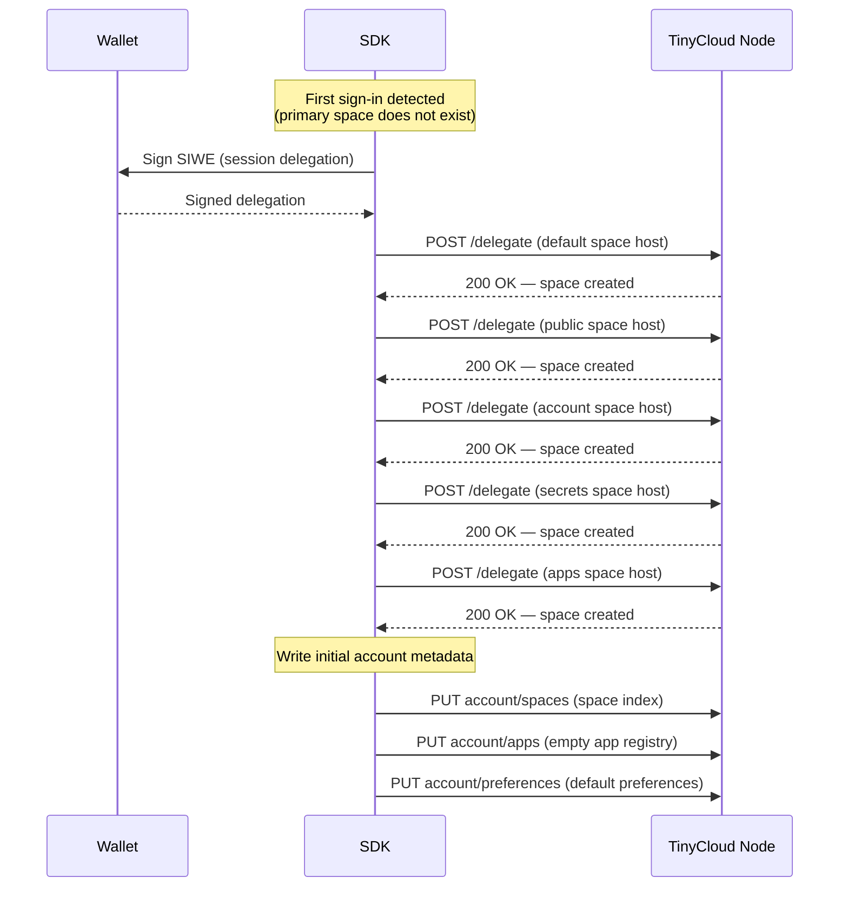
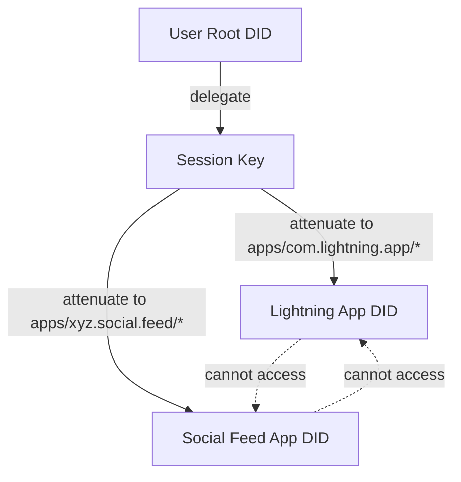

# Appendix L: System Spaces

## Overview

When a user first signs in to TinyCloud, the SDK provisions a set of **system spaces** — well-known spaces with defined purposes that enable core platform functionality. System spaces provide structure for identity, application data, secrets management, and public discovery without requiring protocol-level changes to the server.

System spaces are an **application-layer convention** (SHOULD). The server treats them as ordinary spaces — the reserved name `public` (Appendix K) remains the only server-enforced special case. Conforming SDKs SHOULD create these spaces on first sign-in. Third-party clients MAY omit system spaces if they do not need the functionality they provide.

## L.1 System Space Overview

| Space Name | Visibility | Purpose |
|-----------|------------|---------|
| `default` | Private | User's primary data space |
| `public` | World-readable | Protocol identity data, app-specific public data |
| `account` | Private | Space index metadata, app registry, user preferences |
| `secrets` | Private | Encrypted secrets and plaintext configuration variables |
| `apps` | Private | Per-application data, path-scoped by app identifier |

All system spaces use the standard TinyCloud URI format:

```
tinycloud:pkh:eip155:{chainId}:{address}:{spaceName}
```

Any service available in TinyCloud (KV, SQL, Compute, Encryption) can be used within any system space. Whether data within a space is encrypted depends on the service used to access it — the Vault service encrypts, the KV service stores plaintext. This is a per-operation choice, not a per-space property.

## L.2 Provisioning

### First Sign-In Flow

When a user signs in for the first time, the SDK creates all system spaces in a single provisioning sequence. Each space requires a `tinycloud.space/host` delegation from the user's root DID.



### Idempotency

Space creation is idempotent — the server uses `ON CONFLICT DO NOTHING` when inserting space records. Re-running provisioning against an account that already has system spaces is a no-op.

### Returning Users

On subsequent sign-ins, the SDK detects that the primary space exists and skips provisioning. The session delegation activates against the existing spaces.

### OpenKey Integration

When the connecting application specifies a TinyCloud node URL, OpenKey can auto-sign the provisioning delegations on first connect. This is a configurable setting on the OpenKey instance (default: enabled). The SDK is responsible for specifying which node to provision against — OpenKey acts as the signing mechanism, not the provisioning orchestrator.

## L.3 The `default` Space

The user's primary data space. General-purpose storage for user content, application data, and vault-encrypted entries.

The Vault service (when enabled) stores encrypted data within the default space using the following KV path prefixes:

| Prefix | Purpose |
|--------|---------|
| `vault/{key}` | Encrypted values |
| `keys/{key}` | Encrypted per-entry keys (wrapped by master key) |
| `grants/{recipientDID}/{key}` | Re-encrypted entry keys for sharing |

These prefixes are Vault service conventions, not protocol-level reservations. Applications using plain KV access should avoid these prefixes to prevent collisions.

## L.4 The `public` Space

Defined in Appendix K. World-readable, unauthenticated access, deterministic discovery.

### Protocol-Level Keys (`.well-known/`)

| Key | Content Type | Purpose |
|-----|-------------|---------|
| `.well-known/vault-pubkey` | `application/octet-stream` | X25519 public key for Vault key exchange |
| `.well-known/vault-version` | `text/plain` | Vault protocol version string |
| `.well-known/profile` | `application/json` | User profile (display name, avatar, bio) |
| `.well-known/did-config` | `application/json` | DID configuration and linked identities |

### App-Specific Public Data

Applications that need a public presence publish under an `app.{appId}/` prefix in the public space. This is opt-in — an application's manifest declares whether it requires a public prefix. See §L.7 for details.

## L.5 The `account` Space

An unencrypted private space for system metadata. The account space is the user's index — it tracks what spaces exist, which applications are installed, and user preferences. Unlike the Vault, data in the account space is stored as plaintext KV entries. Access is still restricted to the space controller and their delegates.

### Well-Known Paths

The spec defines three reserved KV paths within the account space. The path names are stable across SDK versions; the JSON schemas within are versioned.

#### `spaces` — Space Index

```json
{
  "version": 1,
  "spaces": [
    {
      "name": "default",
      "spaceId": "tinycloud:pkh:eip155:1:0xabc...:default",
      "system": true,
      "label": "Personal",
      "createdAt": "2025-03-24T12:00:00Z"
    },
    {
      "name": "work",
      "spaceId": "tinycloud:pkh:eip155:1:0xabc...:work",
      "system": false,
      "label": "Work Projects",
      "createdAt": "2025-04-01T09:00:00Z"
    }
  ]
}
```

| Field | Type | Description |
|-------|------|-------------|
| `name` | string | Space name (matches URI segment) |
| `spaceId` | string | Full TinyCloud space URI |
| `system` | boolean | Whether this is a system space |
| `label` | string | User-facing display name |
| `createdAt` | string | ISO 8601 timestamp |

The space index stores user-curated metadata that the server does not track — display names, ordering, archive status, labels. It complements (does not replace) the server's `tinycloud.space/list` capability, which returns the authoritative list of spaces hosted for a DID.

#### `apps` — App Registry

```json
{
  "version": 1,
  "apps": [
    {
      "appId": "com.lightning.app",
      "displayName": "Lightning",
      "grantedAt": "2025-03-24T14:00:00Z",
      "delegationCid": "bafy...",
      "capabilities": [
        "tinycloud.kv/get",
        "tinycloud.kv/put",
        "tinycloud.kv/del",
        "tinycloud.kv/list"
      ],
      "publicPrefix": true
    }
  ]
}
```

| Field | Type | Description |
|-------|------|-------------|
| `appId` | string | Reverse-domain app identifier |
| `displayName` | string | Human-readable app name |
| `grantedAt` | string | ISO 8601 timestamp of first authorization |
| `delegationCid` | string | CID of the active delegation |
| `capabilities` | string[] | Granted ability identifiers |
| `publicPrefix` | boolean | Whether the app has a public space prefix |

The app registry is a lightweight delegation record. It does not store app binaries, manifests, or versions — those belong to the app itself. The registry answers: "what have I authorized, and when?"

#### `preferences` — User Preferences

```json
{
  "version": 1,
  "defaultSpace": "default",
  "theme": "system"
}
```

The preferences schema is intentionally minimal and extensible. SDKs may add fields as needed while maintaining backwards compatibility through the version field.

## L.6 The `secrets` Space

A dedicated space for storing sensitive credentials and configuration variables. The secrets space isolates secret material from the user's general-purpose data, enabling separate delegation — an application can be granted access to secrets without seeing the user's other spaces.

### Data Organization

| Prefix | Access Method | Description |
|--------|--------------|-------------|
| `secrets/{name}` | Vault (encrypted) | Write-only secrets — values cannot be read back, only overwritten or deleted |
| `variables/{name}` | KV (plaintext) | Readable configuration variables — environment configs, API endpoints, non-sensitive settings |

### Secret Entry Format

```json
{
  "value": "sk_live_abc123...",
  "createdAt": "2025-03-24T15:00:00Z"
}
```

### Variable Entry Format

```json
{
  "value": "https://api.example.com/v2",
  "createdAt": "2025-03-24T15:00:00Z"
}
```

### Vault Key Derivation

The secrets space has its own Vault master key, derived from the space ID:

```
message: "tinycloud-vault-master-v1:{secretsSpaceId}"
masterKey = HKDF-SHA256(sign(message), SHA256(secretsSpaceId), "vault-master")
```

This is the same derivation used for any space's Vault — the secrets space is not special at the Vault layer, only at the SDK convention layer.

### Frontend

The secrets space is the backend for `secrets.tinycloud.xyz`, a web application for managing secrets and environment variables.

## L.7 The `apps` Space

A private space where applications store their data, isolated by reverse-domain path prefixes. Each application operates within its own prefix and cannot access other applications' data without explicit delegation.

### Path Structure

```
apps space KV layout:

  com.lightning.app/
    data/projects.json
    data/settings.json
    cache/recent.json

  xyz.social.feed/
    posts/draft-1.json
    media/avatar.png
```

Each application's data lives under `{appId}/*`. The SDK enforces this scoping when creating delegations for applications.

### Application Delegation Model

When an application requests access, the SDK creates a delegation scoped to the application's path prefix:

```
Resource: tinycloud:pkh:eip155:1:0xabc...:apps/kv/com.lightning.app/*
Abilities: tinycloud.kv/get, tinycloud.kv/put, tinycloud.kv/del, tinycloud.kv/list
```

The delegation chain enforces isolation:



### App Identification

Applications identify themselves using reverse-domain notation:

```
com.lightning.app      — Lightning IDE
xyz.tinycloud.billing  — TinyCloud Billing
com.example.notes      — Third-party notes app
```

### App Manifest (Optional)

Applications may publish a manifest declaring their identifier, required capabilities, and whether they need a public space prefix. The manifest is optional — applications without a manifest declare their identifier at runtime, and the SDK auto-scopes the delegation.

```json
{
  "appId": "com.lightning.app",
  "displayName": "Lightning",
  "capabilities": {
    "apps": ["tinycloud.kv/get", "tinycloud.kv/put", "tinycloud.kv/list"],
    "public": ["tinycloud.kv/get", "tinycloud.kv/put"]
  },
  "publicPrefix": true
}
```

When a manifest is present, the SDK validates the application's runtime capability requests against it. When absent, the SDK prompts the user to approve the requested capabilities directly.

### Vault Within Apps

Applications can use the Vault service within their path scope. The apps space has a single master key (derived from the apps space ID). All encrypted app data within the space shares this master key.

```
Encrypted: vault/com.lightning.app/api-token
Key:       keys/com.lightning.app/api-token
Plaintext: com.lightning.app/data/settings.json
```

Per-application key derivation is a potential future enhancement but is out of scope for the initial specification.

### Public App Data

Applications that declare `publicPrefix: true` in their manifest (or request it at runtime) receive a delegation to write under `app.{appId}/` in the user's public space:

```
Public space:
  app.com.lightning.app/status.json    — app-published public data
  app.xyz.social.feed/profile.json     — social profile
```

This is a separate delegation from the apps space delegation. The SDK creates both when the application is authorized, if the public prefix is requested.

## L.8 Space Listing

The server provides a `tinycloud.space/list` capability that returns the authoritative list of spaces it hosts for a given DID. This is a signed invocation — the caller must present a valid delegation chain.

```
Resource: tinycloud:pkh:eip155:1:0xabc...:*/space
Ability:  tinycloud.space/list
```

The response includes space names and metadata the server tracks (creation time, storage usage). It does not include user-curated metadata (labels, ordering) — that lives in the account space index.

SDKs should use `tinycloud.space/list` for authoritative existence checks and the account space index for display purposes. When the two diverge (e.g., a space was created on another device), the SDK should reconcile the account index.

## L.9 Security Considerations

| Concern | Mitigation |
|---------|------------|
| **Account space is unencrypted** | Access is still delegation-gated. Only the space controller and explicit delegates can read account data. Sensitive values (passwords, keys) belong in the secrets space, not account. |
| **App path isolation** | Delegation path-scoping is enforced by the server's capability validation. An application's delegation for `apps/kv/com.lightning.app/*` cannot be used to invoke operations on `apps/kv/xyz.social.feed/*`. |
| **App identity spoofing** | Reverse-domain app IDs are conventions, not verified against DNS. A malicious app could claim any identifier. The user's approval of the delegation is the trust anchor, not the app ID itself. Future work may add app identity verification via signed manifests. |
| **Vault master key scope** | The apps space shares one master key. An application with Vault access to its own prefix could theoretically attempt to read other apps' encrypted data if it obtained the raw KV paths. Delegation path-scoping prevents this at the invocation layer. |
| **System space proliferation** | Five spaces per user is a fixed cost. Space creation is idempotent and the server applies per-space quotas. The overhead is bounded. |
| **Account index staleness** | The account space index is a client-maintained mirror. If spaces are created on other devices or through direct server interaction, the index may lag. SDKs should reconcile on session start. |

## References

- Appendix H: Delegation Protocol Specification (Delegation chain validation)
- Appendix I: SDK Interface Specification (SDK provisioning interface)
- Appendix J: Services Specification (KV and Vault service actions)
- Appendix K: Public Spaces (Public space model and `.well-known/` conventions)
