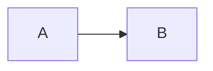

# TinyCloud Whitepaper Diagrams

This folder contains diagrams for the TinyCloud whitepaper, organized by type and intended usage.

## Diagram Types

### Excalidraw (Conceptual)
Hand-drawn style diagrams for conceptual explanations in the main whitepaper.

| File | Section | Description |
|------|---------|-------------|
| `namespace-overview.excalidraw` | 2. Autonomic Namespace | TinyCloud namespace as self-contained unit |
| `delegation-chain-concept.excalidraw` | 3. Authorization Model | Authority flow from root DID to session keys |
| `services-overview.excalidraw` | 4. Services | KV, Compute, Encryption services overview |
| `encryption-flow.excalidraw` | 4. Services | Threshold decryption and PRE flow |

### Mermaid - Simplified (Main Paper)
Process diagrams for the main whitepaper.

| File | Section | Description |
|------|---------|-------------|
| `epoch-dag.mermaid` | 5. Consistency | Epoch DAG structure with forks and merges |
| `session-key-flow.mermaid` | 3. Authorization | Session key delegation sequence |
| `delegation-chain.mermaid` | 3. Authorization | Delegation chain flowchart |

### Mermaid - Detailed (Appendix)
Technical diagrams for the Technical Appendix.

| File | Appendix Section | Description |
|------|------------------|-------------|
| `capability-validation.mermaid` | D. Detailed Diagrams | Full validation flowchart |
| `replication-protocol.mermaid` | D. Detailed Diagrams | P2P replication sequence |
| `kv-write-process.mermaid` | D. Detailed Diagrams | KV store write process |

## Usage

### Importing into Markdown

**Mermaid diagrams** can be embedded directly:
```markdown

```

Or referenced as external files (requires renderer support):
```markdown

```

**Excalidraw diagrams** should be:
1. Opened in [Excalidraw](https://excalidraw.com)
2. Filled in with actual content based on the metadata description
3. Exported as PNG/SVG
4. Referenced in markdown: ``

## Editing Excalidraw Files

The `.excalidraw` files are JSON-based placeholders. To edit:

1. Go to https://excalidraw.com
2. File > Open > Select the `.excalidraw` file
3. Create the diagram based on the description in the `metadata.description` field
4. File > Save to disk (overwrites the file with actual content)
5. Export as PNG/SVG for markdown embedding

## Rendering Mermaid

Mermaid diagrams render automatically in:
- GitHub markdown
- Many markdown editors (Obsidian, VS Code with extensions)
- Documentation tools (Docusaurus, GitBook)

For manual rendering, use:
- [Mermaid Live Editor](https://mermaid.live)
- `mmdc` CLI: `npx -p @mermaid-js/mermaid-cli mmdc -i input.mermaid -o output.svg`
